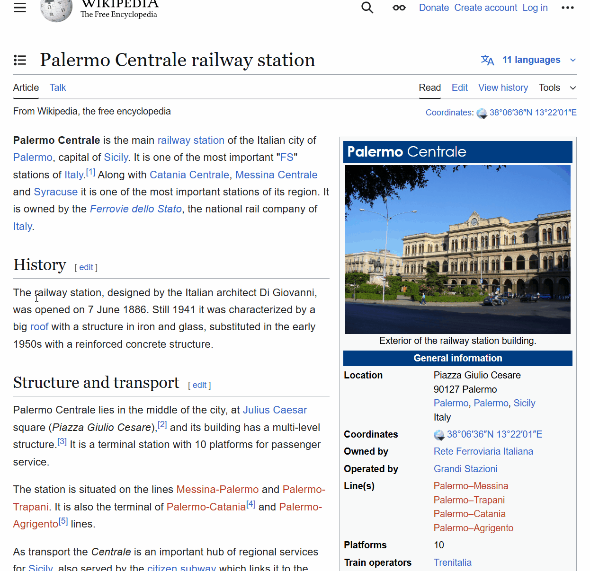

# context-image-search
Extension that adds and text-to-image search in Google Chrome right-click menu.

# Search Google Images from Text

A lightweight Chrome extension that adds a right-click menu option to search selected text directly on **Google Images**.

## Features

- Adds a context menu item: “Search Google Images for ‘...’”
- Opens image search results in a new tab
- Clean and minimal — no tracking, ads, or bloat
- Works anywhere you can select text (webpages, forms, etc.)

## How to Install (Development Mode)

1. Clone or download this repository
2. Open Google Chrome and navigate to `chrome://extensions`
3. Enable **Developer Mode** (top right)
4. Click **"Load unpacked"** and select the extension folder
5. Highlight text on any webpage, right-click, and select **“Search Google Images for '...'”**

## 👨‍💻 Author

[FGomezCode](https://fgomez.dev)  
Feel free to reach out for questions or improvements.

## 📝 License

This project is licensed under the [MIT License](LICENSE).
